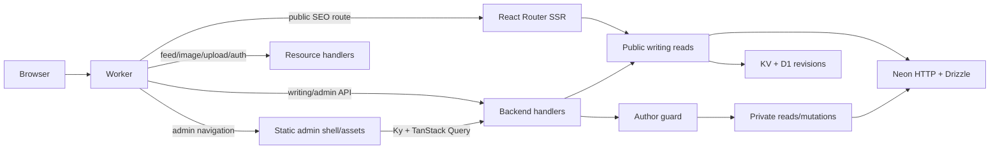

# Architecture

The site uses React Router **8.4.0** Framework Mode on Cloudflare Workers. The admin
is a separately built React application using browser routing. Vite produces both
bundles; the Cloudflare Vite plugin packages the SSR Worker and client assets.

The [project structure and environment guide](docs/project-structure-and-environment.md)
explains why `app/`, `admin/` and `workers/` sit at the repository root, where new
code belongs, and how local environment, database and authentication URLs relate.

Admin route modules are grouped under `admin/routes/{auth,dashboard,posts}/` and
mapped explicitly by `admin/routes.tsx`. `admin/layouts/protected-admin.tsx` owns
the browser session lifecycle, `admin/auth/session.tsx` provides the shared
context/hook, and common UI is grouped in `admin/components/{auth,layout,feedback}/`.
Domain UI and behavior remain in `features/`; moving route files does not change URLs.

## Request paths

`workers/app.ts` dispatches early and dynamically imports the relevant server
handler. Admin navigation serves `admin/index.html`; it never imports the public
React SSR tree. A missing session cookie can redirect the browser to login,
but cookie presence is only a navigation convenience. Every private API and
underlying data operation verifies the actual session and numeric GitHub allowlist.

`lib/runtime.server.ts` stores Request, Worker bindings and execution context in
AsyncLocalStorage. Concurrent requests keep separate contexts. Server modules use
this context for runtime secrets; build tools define an explicit safe public
variable allowlist. `.env.example` documents the shared `.env.local` settings used
by Vite, local Worker bindings and database tooling. Preview passes the root file
explicitly to Wrangler and puts exported overrides in a protected temporary dotenv
file outside the build. Deployed secrets and resource bindings remain configured
through Cloudflare and Wrangler.

## Rendering policy

| Route/content                   | Policy                      | Reason                                                                        |
| ------------------------------- | --------------------------- | ----------------------------------------------------------------------------- |
| `/`, `/resume`, `/tech-stack`   | SSR                         | Profile content and metadata are meaningful before JavaScript                 |
| Home recent-writing section     | CSR/API                     | Avoid querying/rendering cards in profile SSR                                 |
| `/writing`, series cards        | CSR/API inside public shell | Browser owns list/search state and loading/error UI                           |
| `/writing/:slug`                | SSR                         | Full article HTML, canonical, metadata and JSON-LD for SEO                    |
| `/writing/:slug/preview`        | CSR/signed API              | Private draft preview does not need SEO or React SSR                          |
| `/admin/*`                      | Independent CSR application | Dashboard/editor/data are private and do not need SEO                         |
| RSS/sitemap/robots/social cards | Resource responses          | Machine-readable metadata and images stay available without client JavaScript |

A public writing page shell may still use the public SSR layout; its cards/results
are not fetched or rendered on the server. Admin is fully independent of SSR.
CSR does not eliminate server authentication, validation, database or rendering
work in preview APIs. Published article SSR and first-time syntax highlighting
remain potentially expensive and must be measured in deployed CPU profiles.

## Client state and API contracts

`components/query-provider.tsx` creates the QueryClient for each application.
Browser route loaders and components share that cache; SSR requests each create
their own. Public writing client loaders and admin data loaders prepare destination
data before committing navigation. Both apps use `react-top-loading-bar` for
in-app transitions, retaining the current page; hard loads show a centered spinner
while initial data is pending. The admin HTML includes a spinner before its scripts
load. Background refreshes do not replace content or restart the indicator.
Queries have a one-minute stale time, no automatic retry and no focus refetch;
mutations are never retried. Session queries deliberately require freshness when
admin access is checked. Save/status/delete invalidate the affected admin/public
keys rather than reloading the document. Ky uses same-origin credentials and a
bounded timeout. Loading, empty and error states are different UI states.

The unified `/writing` archive commits search, sort, tags, publication dates and
reading durations to URL query state. Its filter sheet keeps changes in a draft
until Apply; closing discards them. Server validation normalizes the same contract
for `/api/writing/posts`, and SQL applies filters before count/page queries. Standalone
writing search/tag page routes are removed, while compatibility APIs remain.
Legacy `/blog/search` and `/blog/tag/:tag` links redirect directly to `/writing`
with search/tag query parameters.
The private `/admin/posts` list shares these controls, adds status filtering and
defaults to Recently updated. Its backend filters/counts/pages the full set,
including drafts and archived posts where selected, under session/allowlist
checks and `no-store`. Private tag counts cover all statuses; publication-date
filters exclude null dates. The schema is unchanged.

API functions in `features/writing/api/client.ts` return typed DTOs. The backend
handler is `features/writing/api/server.ts`; SQL stays in the data layer.

| Endpoint                                                                 | Access                                           |
| ------------------------------------------------------------------------ | ------------------------------------------------ |
| `GET /api/writing/posts`, `/recent`, `/tags`, `/search`, `/series/:slug` | Published-only query layer                       |
| `GET /api/writing/preview/:slug?token=...`                               | Valid signed, expiring token for this exact slug |
| `GET /api/admin/session`                                                 | Session state only; anonymous author is null     |
| `GET /api/admin/overview`, `/posts`, `/posts/:id`                        | Author session required                          |
| `POST /api/admin/posts`                                                  | Author, same Origin, JSON, validated save        |
| `PATCH /api/admin/posts/:id/status`                                      | Author, same Origin, validated status            |
| `DELETE /api/admin/posts/:id`, `POST /api/admin/posts/:id/preview`       | Author, same Origin, JSON                        |

Mutation bodies are streamed with a 512 KiB ceiling before JSON parsing, including
requests without Content-Length. Untrusted IDs, tags, limits and page numbers are
validated/bounded before SQL/cache access. Document validation occurs once in the
mutation; the server computes reading time, derived excerpt and timestamps.
Responses use structured safe errors and `no-store`. A 401 never returns private
post data. Preview tokens are bounded and verified before the database; the API
returns sanitized HTML/headings and metadata without raw document duplication.

## Database and cache boundaries

The [D1 and KV cache guide](docs/d1-kv-cache.md) documents the implementation,
local persistence roots, environment selection and remote initialization/inspection.

Public reads enforce published status, publication date and content presence.
There is no boolean flag that can make a public query include drafts. Admin reads
live separately and never persist in KV. Minimal list projections omit bodies;
related tags are aggregated within SQL. Count/page pairs and post/tag writes use
Drizzle's existing Neon HTTP batch API. A failed post/tag write rolls back that
batch; series metadata resolution remains outside the batch, matching the existing
save behavior.

`lib/cache.server.ts` memoizes public reads within one Request, even without storage.
Persistent cache keys include D1 invalidation revisions and use a new namespace
prefix that isolates the application cache format. KV entries expire after one hour;
D1 stores tag revisions in the existing `revalidations` table. Mutations await
invalidation, then clear request memo/version state. Background KV writes use
`waitUntil` when available. Public rendered articles are keyed by post ID, slug,
saved revision and renderer version; bump the renderer version after policy changes.
Draft preview rendering is always uncached.

KV propagation can cause misses/recomputation. D1 revision keys prevent a stale
KV entry from bypassing invalidation. This cache reduces repeated work but cannot
guarantee a CPU budget or prevent simultaneous uncached renders across isolates.

## Shared feature responsibilities

- `app/routes/` owns public route modules and their colocated tests. Modules compose
  feature components and export React Router loaders/metadata; SQL and authorization
  stay in backend modules.
- `admin/components/` owns the common admin shell, navigation and authentication
  buttons. `features/writing/components/admin/` owns editor and post-management UI.
- `components/layout/public-shell.tsx` owns the public layout; `components/ui/`
  provides shared primitives and variants. Public/admin navigation uses React
  Router links and explicit active-state helpers.
- `config/site.ts` owns global `SITE_URL`, `SITE_HOST`, `absoluteUrl` and
  `SOCIAL_LINKS`. Profile-specific configuration remains with its feature.
- `features/home` and `features/resume` own profile data and PDF/social-card
  compositions. The PDF renderer loads only on download in the browser.
- `features/writing` owns query contracts, editor extensions, sanitized content,
  publishing rules, card/article components and preview policy.
- Writing database reads, archive SQL, mutations and rendered-content caching use
  `features/writing/data/*.server.ts`. Authentication, author guards and cover
  storage use `lib/auth.server.ts`, `lib/auth-guard.server.ts` and
  `lib/cover-storage.server.ts`; `lib/db/index.server.ts` owns the server database
  client and `features/writing/utils/preview-token.server.ts` owns signing secrets.
  These explicit server boundaries protect browser bundles from accidental imports.
- Tooling tests sit beside their implementations, including
  `scripts/preview-env.test.ts` beside the preview environment helper.
- Consent gates PostHog initialization and storage; analytics helpers exclude admin/auth tracking and redact preview tokens
  from public pageview URLs. Security headers remain centralized at the Worker.

## Build, quality and review

`npm run build` creates the SSR Worker and admin bundle and checks their assembled
artifacts. `npm run type-check` generates Wrangler binding/runtime types and React
Router route types before TypeScript, so fresh checkouts need no pre-existing
generated files. The generated runtime types replace `@cloudflare/workers-types`.
Vitest covers deterministic behavior and handler boundaries; isolated database tests
verify real query counts and transaction rollback. Playwright runs the built app in
Workerd. Configuration and fixtures are described in [testing](docs/testing.md).

Changes should use existing feature modules, React Router mechanisms and API
contracts; avoid reintroducing server-only dependencies into browser imports.
Build directories and generated type files are ignored. Database schema changes
use Drizzle migrations. CI owns approved deployment to isolated dev/production
Worker resources. No migration work itself authorizes shipping.
